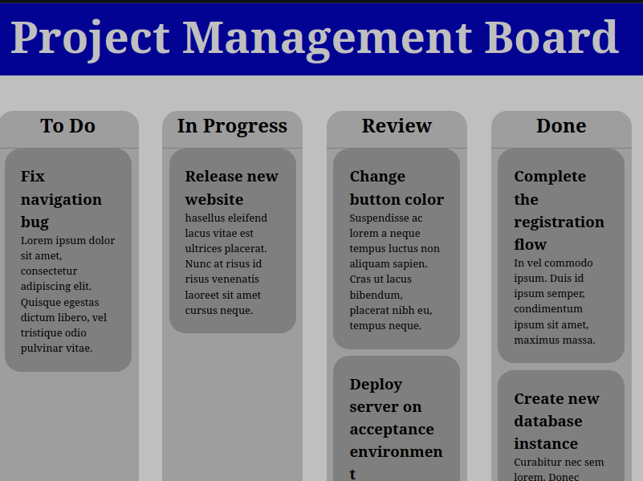

# Management Board

> Dynamic project management board with React and styled-components.

## Live Demo

[Netlify](https://management-board.netlify.app/)

## Table of Contents

- [Management Board](#management-board)
  - [Live Demo](#live-demo)
  - [Table of Contents](#table-of-contents)
  - [Description](#description)
  - [Built With](#built-with)
  - [Getting Started](#getting-started)
    - [Prerequisites](#prerequisites)
    - [Setup](#setup)
  - [Scripts](#scripts)
    - [Start dev server](#start-dev-server)
    - [Build for production](#build-for-production)
    - [Locally preview production build](#locally-preview-production-build)
  - [Author](#author)
  - [🤝 Contributing](#-contributing)
  - [Show your support](#show-your-support)
  - [Acknowledgments](#acknowledgments)
  - [📝 License](#-license)

## Description

Expense tracker app that allows you to track your expenses in different ways.

## Built With

- [React](https://vitejs.dev/) A JavaScript library for building user interfaces.
- [ViteJs](https://vitejs.dev/) Next Generation Frontend Tooling.

## Getting Started

To get a local copy up and running follow these simple example steps.

### Prerequisites

- `node` : `^12 || >=14`
- `npm` or or `pnpm` or `yarn`

### Setup

1. Download or fork this project
2. Extract the content to a new directory, rename it and cd the directory.
3. Install all dependencies using:

- `npm install` or `pnpm install` or `yarn`

## Scripts

### Start dev server

- `npm run dev` or or `pnpm run dev` or `yarn run dev` and open the browser at `http://localhost:3000`

### Build for production

- `npm run build` or `pnpm install` or `yarn run build`

### Locally preview production build

After creating the production build, run:

- `npm run preview` or `yarn run preview` and open the browser at `http://localhost:5173`

## Author

👤 **Fabrizio**

| &nbsp;       | &nbsp;                                               |
| ------------ | ---------------------------------------------------- |
| **GitHub**   | [@fabgrel10](https://github.com/fabgrel10)           |
| **Twitter**  | [@fabgrel10](https://twitter.com/fabgrel10)          |
| **LinkedIn** | [@fabgrel10](https://www.linkedin.com/in/fabgrel10/) |

## 🤝 Contributing

Contributions, issues, and feature requests are welcome!

Feel free to check the [issues page](../../issues/).

## Show your support

Give a ⭐️ if you like this project!

## Acknowledgments

- Coming soon

## 📝 License

This project is [MIT](https://mit-license.org/) licensed. See [LICENSE.md](LICENSE.md) for details.
